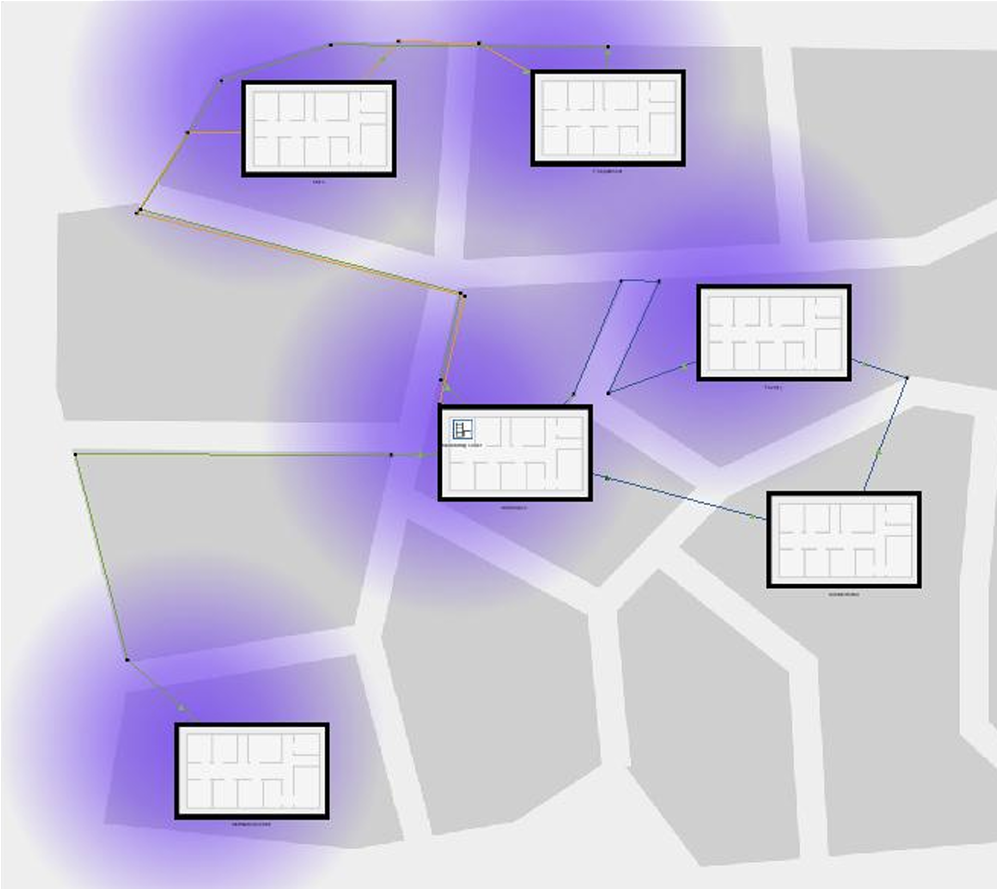
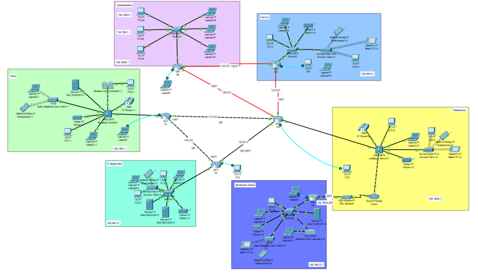

# 🌐 Enterprise Multi-Branch Network Infrastructure
> **Developed by: @KhalidExe & @vd2mi**
> **Academic Project | CIS 326 - Network Administration | IAU**

## 📋 Project Overview
A sophisticated network architecture designed for a corporation with **6 distributed branches**: Store, Warehouse, IT Department, Distribution Center, Factory, and Administration[cite: 398, 399, 400, 401, 402, 403, 404]. This project demonstrates a highly scalable infrastructure using Cisco Packet Tracer to simulate real-world environments with both **Logical** and **Physical** implementations[cite: 396, 397].

---

## 🛠️ Technical Highlights & Implementation

### 1. Hybrid Dynamic Routing 🔄
* **Protocols:** Dual implementation using **OSPF** and **RIPv2** protocols[cite: 124, 126].
* **Route Redistribution:** Configured protocol merging on **Router 2** to ensure full reachability across different routing domains[cite: 273, 279, 280].
* **Addressing:** Organized IP allocation with custom subnet masks for global (/8) and internal (/24) operations[cite: 393, 394].

### 2. Network Segmentation & Security 🛡️
* **VLAN Deployment:** Dedicated VLANs for each branch to enhance security and traffic management[cite: 129, 130, 405].
* **VLAN IDs:** Store (100), Warehouse (400), IT (200), Distribution (500), Factory (300), and Admin (10, 20, 30)[cite: 406, 407, 408, 409, 410, 411, 412, 413].

### 3. Advanced Services (VoIP & Wireless) 📞
* **VoIP Infrastructure:** Cisco IP Phones configured with dedicated Voice VLANs for inter-branch communication[cite: 281, 282, 285, 414].
* **Centralized Wireless:** Managed via **WLC (Wireless LAN Controller)** with WPA2-PSK security policies[cite: 136, 314, 315, 370].
* **Server Roles:** Deployed centralized **DNS** and **Web Servers** to host internal corporate resources[cite: 134, 135, 136, 348].

---

## 📐 Network Views

### 🔹 Physical Implementation
* **Realistic Simulation:** Fully organized **Physical View** depicting the actual distribution of devices, racks, and structured cabling across all 6 branches[cite: 431, 432, 433, 434].

### 🔹 Logical Topology
  
*Note: High-level logical representation of the 6-router interconnected network.*

---

## 🧪 Verification & Results
* **Connectivity:** 100% successful **ICMP Ping tests** verified across all branch subnets[cite: 447, 448, 449].
* **Domain Access:** Verified successful access to the corporate internal site via the "IT" domain name[cite: 451, 452].

---
**Main Developers:** @KhalidExe & @vd2mi.
